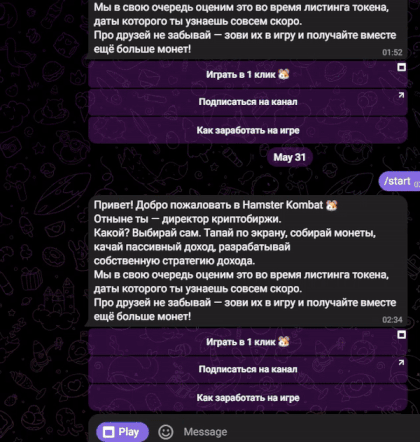

> [!NOTE]
> - Contacts: [Telegram](https://t.me/mudachyo)
> - Channel: [Telegram Channel](https://t.me/shopalenka) 
> - توضیحات به زبان فارسی [اینجا](README-FA.md)
---
## How to run  
- Install Violentmonkey extension in your browser [Chrome](https://chromewebstore.google.com/detail/violentmonkey/jinjaccalgkegednnccohejagnlnfdag?hl=be) | [FireFox](https://addons.mozilla.org/firefox/addon/violentmonkey/) | [MicrosoftEdge](https://microsoftedge.microsoft.com/addons/detail/eeagobfjdenkkddmbclomhiblgggliao)
- In order for TapSwap to open in a browser, install [this script](https://github.com/amir-homous/TapSwap/raw/main/tapswap-web.user.js)
- To install **autoclicker** install [this script](https://github.com/amir-homous/TapSwap/raw/main/tapswap-autoclicker.user.js)
- Open [Bot TapSwap](https://t.me/hamster_kombAt_bot/start?startapp=kentId665346234) and run the game

- 

---
> [!TIP]
> Other repositories:
> 
> - [Hamster Kombat + Autoclicker](https://github.com/mudachyo/Hamster-Kombat)
> 
> - [TapSwap + Autoclicker](https://github.com/mudachyo/TapSwap)
> 
> - [Blum + Autoclicker](https://github.com/mudachyo/Blum)
>
> - [PixelTap + Autoclicker](https://github.com/mudachyo/PixelTap)
> 
> - [MemeFi + Autoclicker](https://github.com/mudachyo/MemeFi-Coin)
>
> - [Yescoin + Autoclicker](https://github.com/mudachyo/Yescoin)
>
> - [Gemz + Autoclicker](https://github.com/mudachyo/Gemz)
>
> - [Сrossfi + Autoclicker](https://github.com/mudachyo/Сrossfi)
>
> - [BUMP](https://github.com/mudachyo/BUMP)
>
> - [W-Coin](https://github.com/mudachyo/W-Coin)
---
> [!IMPORTANT] 
> Donation
> 
> We accept the following cryptocurrencies:
> 
> - **TON**: `UQCGUzPN5GnFqWJiYsFtqqLGO75-cBXlOL8f_qbd7yKY2Tzh`
> 
> - **USDT**(TRC20): `TFr8CiAPqEnSyoXHtVefWumodcXgjoB8rS`
> 
> - **USDT**(TON): `UQCGUzPN5GnFqWJiYsFtqqLGO75-cBXlOL8f_qbd7yKY2Tzh`
> 
> - **NOTCOIN**(TON): `UQCGUzPN5GnFqWJiYsFtqqLGO75-cBXlOL8f_qbd7yKY2Tzh`
> 
> - **BTC**: `1Mba8xKKVLdcFJdV7jD8Ba3fFn7DWbp4bt`
> 
> Donations will be used to maintain the project.
